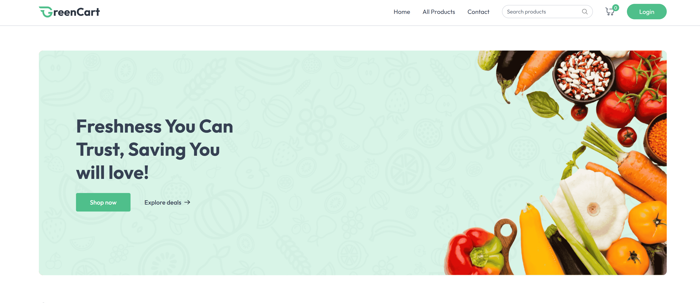
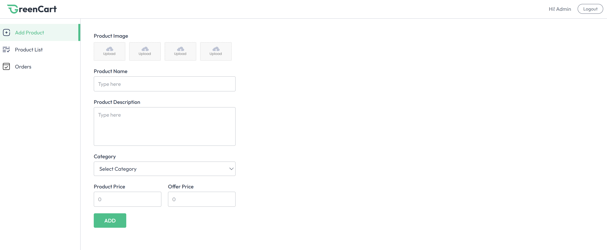
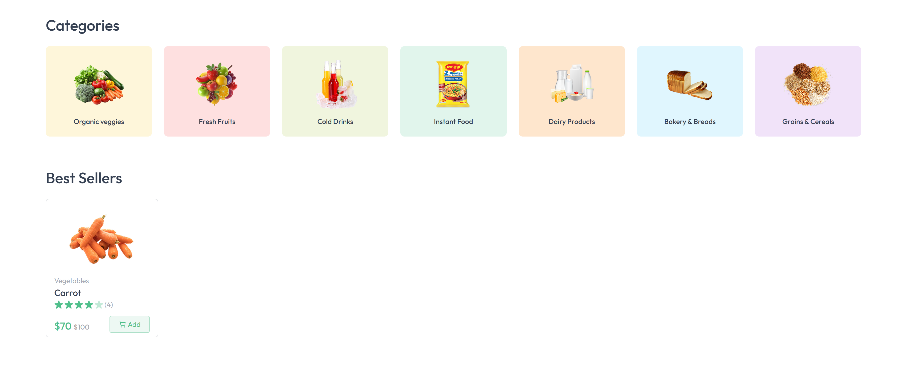
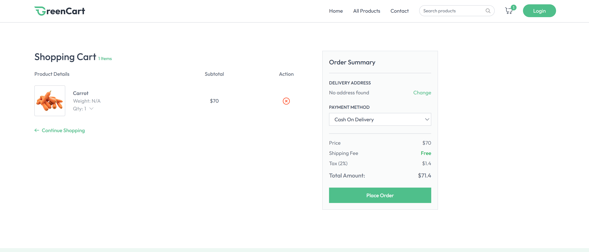

<h1 align="center"> Greencart Project </h1>

  <a href="#-technologies">Technologies</a>&nbsp;&nbsp;&nbsp;|&nbsp;&nbsp;&nbsp;
  <a href="#-project">Project</a>&nbsp;&nbsp;&nbsp;|&nbsp;&nbsp;&nbsp;
  <a href="#memo-license">License</a>

  

 

  

  

  

  

## 🚀 Technologies

This project was developed using the following technologies:

- React
- TailwindCSS
- JavaScript
- Git and Github

## 💻 Project

Greencart is a responsive project where I used web modern technologies (mainly JavaScript).The project was made for fun and to improve my skills as a programmer. 

## :memo: License

This project is licensed under the MIT License